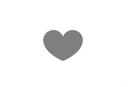

Crea una animación para un botón de like. En esta carpeta encontrarás un HTML con el SVG de corazón, un script que le asignará automáticamente la clase "like" a dicho SVG al hacerle click y un css con algunos estilos, para que lo único de lo que debas preocuparte sea de la animación.

